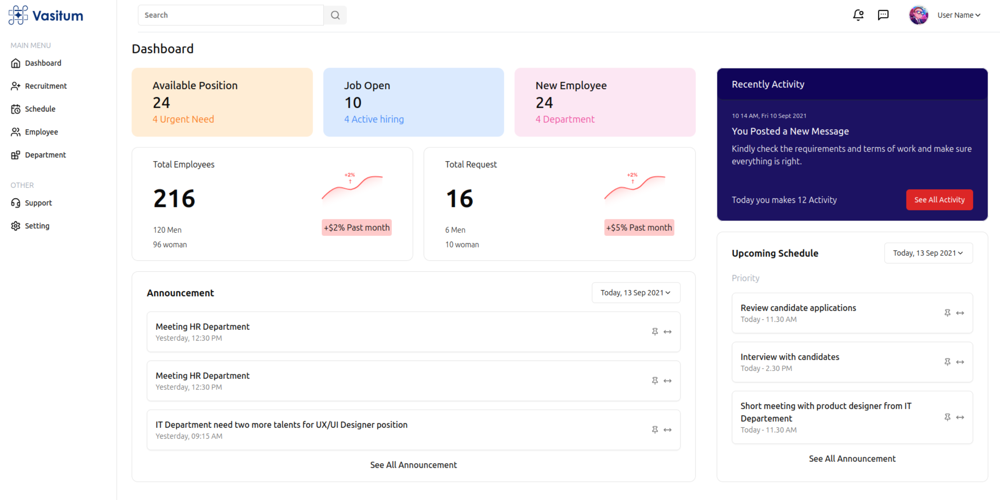
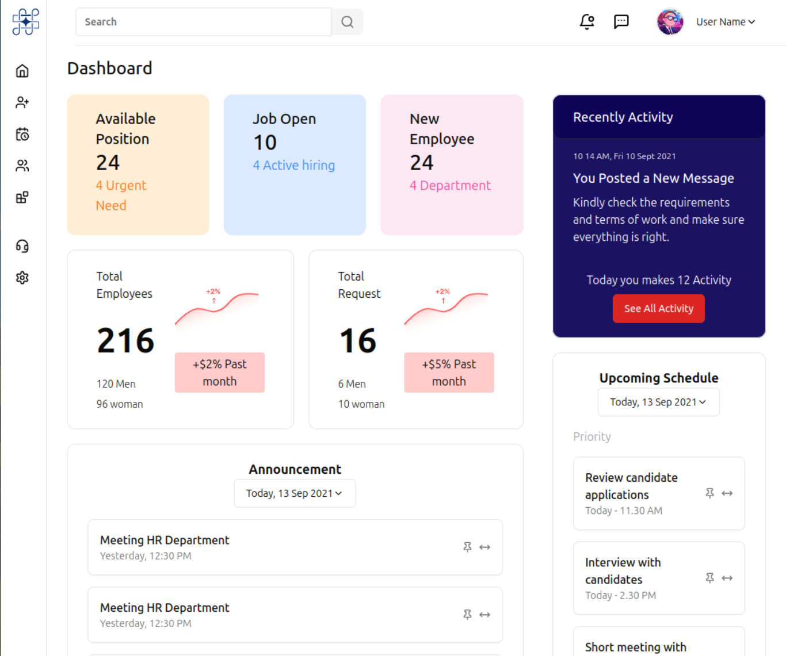
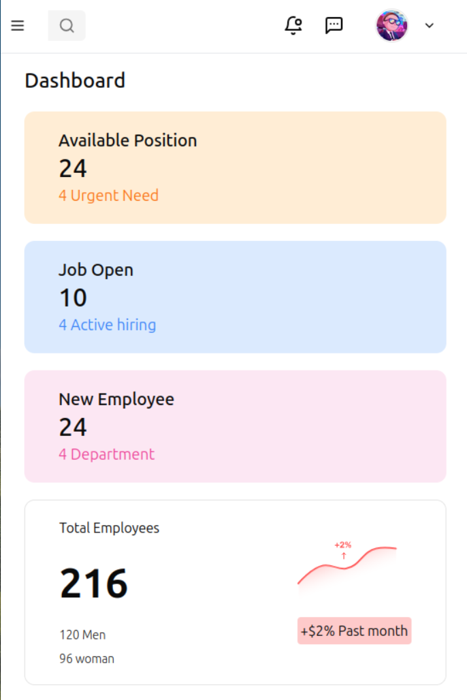
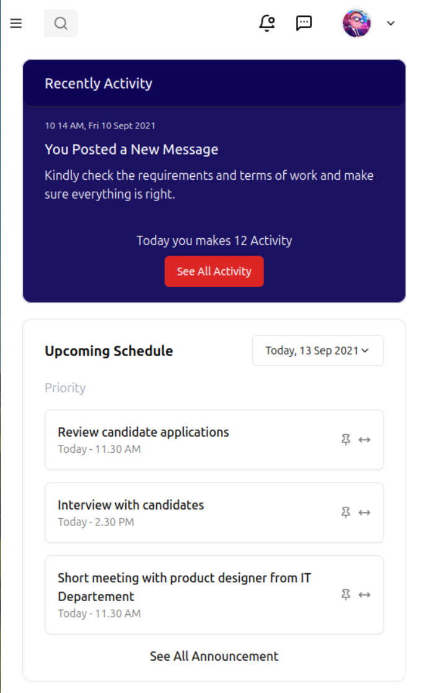

Here’s a **README.md** file structure for your project. You can replace the placeholders like `<!-- Screenshots here -->` with actual content and screenshots once you have them ready.

---

# Assignment Frontend Project

### Hosted Link: [Assignment Frontend](https://assignementfrontend.netlify.app/)

---

## Table of Contents
- [Project Overview](#project-overview)
- [Features](#features)
- [Technologies Used](#technologies-used)
- [Installation](#installation)
- [Usage](#usage)
- [Components](#components)
- [Responsive Design](#responsive-design)
- [Deployment](#deployment)
- [Screenshots](#screenshots)
- [Contributing](#contributing)
- [License](#license)

---

## Project Overview

This is a simple frontend project developed using **React** to demonstrate the use of reusable components and responsive web design. The project includes two reusable components, which are rendered multiple times with different static data. The application has been made responsive for web and mobile devices and styled using **CSS** to make it visually engaging.

---

## Features

- Reusable components to ensure modularity and clean code.
- Multiple instances of components with different data.
- Responsive design for both desktop and mobile devices.
- Styled with CSS to create an appealing user interface.
- Hosted on Netlify for easy access and review.

---

## Technologies Used

- **React** (Create React App)
- **CSS** for styling
- **Tailwind CSS** for responsive design
- **Netlify** for hosting

---

## Installation

To run the project locally, follow these steps:

1. Clone the repository:
   ```bash
   https://github.com/Surajsinhar77/react-assignment
   ```

2. Navigate to the project folder:
   ```bash
   cd assignment-frontend
   ```

3. Install dependencies:
   ```bash
   npm install
   ```

4. Start the project:
   ```bash
   npm start
   ```

This will launch the app in development mode on `http://localhost:5173`.

---

## Usage

The app contains two reusable components:
1. **Component A** (e.g., `ActiveBox`): This component is reused multiple times with different static content.
2. **Component B** (e.g., `UserDataBox`): Similarly reused with different sets of static data.

The components are styled to be responsive across web and mobile breakpoints.

---

## Components

### 1. `ActiveBox`
- A reusable component representing an active box with static content.
- Displayed multiple times in a grid layout.

### 2. `UserDataBox`
- Another reusable component that shows user-related data.
- Reused in a similar fashion with varying content.

### Component Structure:
```jsx
const ActiveBox = () => {
  return (
    <div className="box">
      <h3>Active Box</h3>
    </div>
  );
};

const UserDataBox = () => {
  return (
    <div className="user-data">
      <h3>User Data</h3>
    </div>
  );
};
```

---

## Responsive Design

The application has been optimized for:
- **Web**: Standard desktop view.
- **Mobile**: Adjustments for smaller screen sizes.

Tailwind CSS breakpoints are used to ensure responsiveness:
- Web layout for larger screens (`lg` and above).
- Mobile layout for smaller screens (`sm` and below).

---

## Deployment

The project has been deployed on **Netlify**. You can view the live project here:

[Assignment Frontend Project](https://assignementfrontend.netlify.app/)

---

## Screenshots

### Web View:
<!-- Screenshots here -->


### Mobile View:
<!-- Screenshots here -->


---

## Contributing

Contributions are welcome! Feel free to open a pull request or issue if you have suggestions or improvements.

---

## License

This project is licensed under the MIT License - see the [LICENSE](LICENSE) file for details.

---

Feel free to update the repository link and component details based on your actual project.